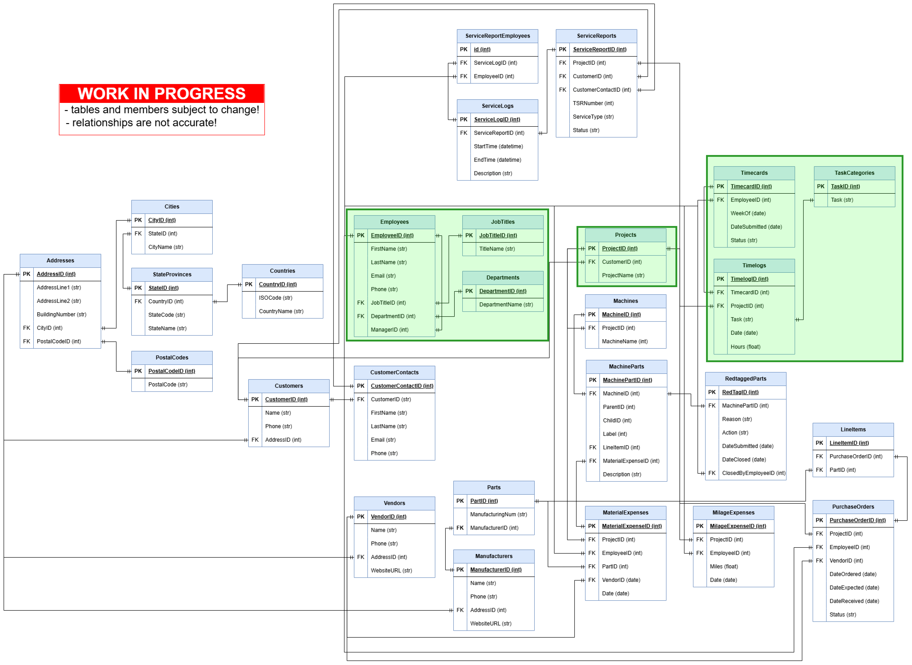

# Timesheet Pipeline

This project is a work in progress pipeline for TruNorth timesheet data.

The goal is to ingest historical and future timesheets, store the parsed time logs in a relational database, and provide simple dashboards for visualizing hours spent on projects and their related project tasks.

As this is V1, both the database and dashboard are locally run within a docker container.

## Process
Ingest the timesheet information within the TruNorth Excel Timesheets (we use a template which makes this pretty easy), upsert (update or insert) this data into respective database tables, view data within dashboard.

## Database
The current database model is shown below. The green tables are the tables currently being operated on by this project. This is a rough draft of the TruNorth Database.


## Running the Application

### Full stack (Docker)

Requires Docker + Docker Compose. Starts the Dash app and attached SQLite database container.

```bash
docker compose up --build
```

Then open the dashboard at [http://localhost:8050](http://localhost:8050).

To stop:

```bash
docker compose down
```

### Dev mode (UI hot reload, no Docker)

For fast UI work. Runs the dashboard locally with hot reload and skips Docker and the database.

Install dependencies once (use a virtual environment):

```bash
pip install -r requirements.txt
```

Start dev mode:

```bash
python dev.py
```

Open the dashboard at [http://localhost:8050](http://localhost:8050). UI file edits auto-refresh in the browser.

Dev mode sets `DISABLE_DB=1` so database logic is skipped. Use Docker for full pipeline runs.

Optional environment variables:

| Variable | Default | Purpose |
|----------|---------|---------|
| `DASH_HOST` | `127.0.0.1` | Bind address |
| `DASH_PORT` | `8050` | Port |
| `DISABLE_DB` | `1` (set by `dev.py`) | Skip database access |
